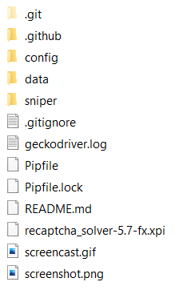
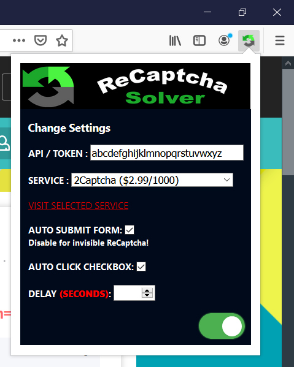

# nvidia-sniper [](https://discord.gg/rks69fD) [](https://paypal.me/PhilippNormann)

This bot helps us buy Nvidia Founders Edition GPUs as soon as they become available.

## Features

- Continuously monitor the availability of target GPU on www.nvidia.com
- Automatically checkout item using PayPal or as guest (credit card)
- Automatically submit the order for credit card payment
- Support for multiple locales (as defined in `config/customer.json`)
- Support for multiple GPUs (as defined in `data/gpus.json`)


## Contents

* [Features](#Features)
* [Supported GPUs](#Supported-GPUs)
* [Installation](#Installation)
  * [Linux (Ubuntu)](#Linux-(Ubuntu))
  * [Mac](#Mac)
  * [Windows](#Windows)
  * [CAPTCHA](#CAPTCHA)
* [Updating](#Updating)
* [Usage](#Usage)
* [Configuration](#Configuration)

## Supported GPUs

- GeForce RTX 3090
- GeForce RTX 3080
- GeForce RTX 3070
- NVIDIA TITAN RTX
- GeForce RTX 2080 Super
- GeForce RTX 2070 Super
- GeForce RTX 2060 Super

## Installation

To run the bot, we need the following things:

- Python 3.8
- Pipenv
- Firefox

### Linux (Ubuntu)
```bash
sudo apt install firefox python3 pipenv
cd nvidia-sniper
pipenv install
```

### Mac
1. Install the latest version of [Firefox](https://www.firefox.com/)
2. Install [brew](https://brew.sh/index_de) package manager
3. Install Pipenv using
    - `brew install pipenv`
4. Navigate to project directory using
    - `cd nvidia-sniper`
5. Install project dependencies using
    - `pipenv install`

### Windows
1. Check if you already have a Python 3.8 installation by opening Windows PowerShell and executing `python --version`
    - If you see `Python 3.8.0` or higher, skip to step 4
    - If you see `Python 3.7.9` or lower, skip to step 2
    - If you see `python : The term 'python' is not recognized`, continue to step 2
2. Install the latest [Python 3.8](https://www.microsoft.com/en-us/p/python-38/9mssztt1n39l) for Windows
3. Ensure you have the correct Python on your PATH
    - Open the Start menu and enter `PATH`, then press Enter
    - Click the `Environment Vairables...` button
    - In the `User variables for user` section, click the variable `Path`, then click the `Edit...` button
    - A new window called `Edit environment variable` will pop up, ensure `C:\Users\user\AppData\Local\Microsoft\WindowsApps` exists in this list, where `user` is your username in Windows
    - If that path is not in the list, add it using the `New` button
    - Remove all other PATHs which contain anything to do with Python, Pip, or Idle by clicking them, then clicking the `Delete` button
    - Click `OK` to close the `Edit environment variable` window
    - Click `OK` to close the `Environment Variables` window
    - Click `OK` to close the `System Properties` window
4. Install the latest version of [Firefox](https://www.firefox.com/)
5. Exit all PowerShell windows, then open a new PowerShell and install Pipenv using
    - `pip install pipenv`
6. Navigate to project directory
    - If you downloaded (using git clone, or ZIP and extract) the project to `C:\Users\user\Documents\nvidia-sniper`, then use the following command: `cd C:\Users\user\Documents\nvidia-sniper`
7. Install project dependencies using
    - `pipenv install`
8. Install curses for Windows using
    - `pipenv install windows-curses`

<details>
  <summary>If step 7 results in `pipenv : The term 'pipenv' is not recognized`</summary>

  1. Setup a virtual environment using
      - `python -m venv .venv`
  2. Ensure you have the latest Python version using
      - `python -m venv --upgrade .venv`
  3. Activate the virtual environment using
      - `.venv/Scripts/activate`
  4. Install `pipenv` again using
      - `pip install pipenv`
  5. Install project dependencies using
      - `pipenv install`
  6. Install curses for Windows using
      - `pipenv install windows-curses`
</details>

### CAPTCHA

To enable CAPTCHA support, follow these steps.

1. Download the [ReCaptcha Solver](https://addons.mozilla.org/en-US/firefox/addon/recaptcha-solver) extension using the link https://addons.mozilla.org/firefox/downloads/file/3423472/recaptcha_solver-5.7-fx.xpi. If you open this link in Firefox, it will automatically attempt to add the extension to your browser. That's not what we want. We want to download the *.xpi file. Try using the link in a browser other than Firefox.
2. Put the *.xpi file inside the root of the `nvidia-sniper` directory.

    

3. Create an account using one of ReCaptcha Solver's supported APIs, ex. [2captcha](http://2captcha.com/?from=10326385). Deposit money into your account. A few :dollar: should be enough.
4. Start the bot as per the instructions in the [Usage](#Usage) section. After you go through the bot's selection process, you should see the ReCaptcha Solver extension in the browser.
5. Copy your API key from the provider of your choice. Add this key to the extension. Also, enable the checkboxes as shown below.

    

## Updating
To update `nvidia-sniper` use, `git pull` or download a fresh `.zip` archive from GitHub.

Make sure to back up the `customer.json` in advance as it might get replaced in the process.
## Usage

To use the bot, fill out `config/customer.json` and run the script.

```bash
cd nvidia-sniper
pipenv run python -m sniper
```

It is highly recommended that after starting the bot, you open gmail(or another Google service) in a new tab of the bot's browser and login.  Afterwards, you can close that tab.  This greatly reduces the possibility of recaptcha requiring you to pass an image test, thus speeding up the checkout significantly.
## Configuration
In the `config` folder a `customer.json` file and `notifications.json` file are used to configure the data used to auto fill the forms and to configure the bots notifications. To get started, copy and rename the two template files and customize the fields to your liking.

### `notifications.json`
The bot can send multiple push notifications, including a screenshot attachment along the checkout process. See https://github.com/caronc/apprise#supported-notifications for more information. Add additional entries to the `services` dictionary in the `notifications.json` file for multiple providers. For each notification, a custom `message` can be set. Additionally, the `screenshot` attachment can be toggled per provider.

A couple of example URLs for different notification services:
- `pover://user@token`: Pushover
- `tgram://bottoken/ChatID`: Telegram
- `discord://webhook_id/webhook_token`: Discord

### `customer.json`
In the `customer.json` file you can configure your locale and the field contents used for auto-filling the checkout forms. Some fields require specific values.

### `locale`
The `locale` field can have the following values:
- `de-at`: Austria
- `fr-fr`: Belgium
- `en-ca`: Canada
- `cs-cz`: Czech Republic
- `da-dk`: Denmark
- `fi-fi`: Finland
- `fr-fr`: France
- `de-de`: Germany
- `it-it`: Italy
- `fr-fr`: Luxembourg
- `nl-nl`: Netherlands
- `pl-pl`: Poland
- `ru-ru`: Russian Federation
- `es-es`: Spain
- `sv-se`: Sweden
- `en-gb`: United Kingdom
- `en-us`: United States


### `speed`
The `speed` field can have the following values:
- `shippingOptionID2`: Standard Ground
- `shippingOptionID3`: Next Business day Afternoon
- `shippingOptionID4`: Second Business Day Afternoon

### `backup-speed`
There has been a common issue related to shipping speeds not being available when cards are available.
- `true`: (Default) Fallback to using the standard shipping speed when the desired speed isn't available
- `false`: Stop the bot from continuing with checkout

### `country`
The `country` field can have the following values:
- `AT`: Austria
- `BE`: Belgium
- `CA`: Canada
- `CZ`: Czech Republic
- `DK`: Denmark
- `FI`: Finland
- `FR`: France
- `DE`: Germany
- `IT`: Italy
- `LU`: Luxembourg
- `NL`: Netherlands
- `PL`: Poland
- `RU`: Russian Federation
- `ES`: Spain
- `SE`: Sweden
- `GB`: United Kingdom
- `US`: United States

### `state`
For `en-us` locale, the `state` field can have the following values:
- `AL`: Alabama
- `AK`: Alaska
- `AB`: Alberta
- `AS`: American Samoa
- `AZ`: Arizona
- `AR`: Arkansas
- `AA`: Armed Forces America
- `AE`: Armed Forces Europe
- `AP`: Armed Forces Pacific
- `BC`: British Columbia
- `CA`: California
- `CO`: Colorado
- `CT`: Connecticut
- `DE`: Delaware
- `DC`: District Of Columbia
- `FM`: Federated States of Micronesia
- `FL`: Florida
- `GA`: Georgia
- `GU`: Guam
- `HI`: Hawaii
- `ID`: Idaho
- `IL`: Illinois
- `IN`: Indiana
- `IA`: Iowa
- `KS`: Kansas
- `KY`: Kentucky
- `LA`: Louisiana
- `ME`: Maine
- `MB`: Manitoba
- `MH`: Marshall Islands
- `MD`: Maryland
- `MA`: Massachusetts
- `MI`: Michigan
- `MN`: Minnesota
- `MS`: Mississippi
- `MO`: Missouri
- `MT`: Montana
- `NE`: Nebraska
- `NV`: Nevada
- `NB`: New Brunswick
- `NH`: New Hampshire
- `NJ`: New Jersey
- `NM`: New Mexico
- `NY`: New York
- `NL`: Newfoundland and Labrador
- `NC`: North Carolina
- `ND`: North Dakota
- `MP`: Northern Mariana Islands
- `NT`: Northwest Territories
- `NS`: Nova Scotia
- `NU`: Nunavut
- `OH`: Ohio
- `OK`: Oklahoma
- `ON`: Ontario
- `OR`: Oregon
- `PW`: Palau
- `PA`: Pennsylvania
- `PE`: Prince Edward Island
- `PR`: Puerto Rico
- `QC`: Quebec
- `RI`: Rhode Island
- `SK`: Saskatchewan
- `SC`: South Carolina
- `SD`: South Dakota
- `TN`: Tennessee
- `TX`: Texas
- `UT`: Utah
- `VT`: Vermont
- `VI`: Virgin Islands
- `VA`: Virginia
- `WA`: Washington
- `WV`: West Virginia
- `WI`: Wisconsin
- `WY`: Wyoming
- `YT`: Yukon
